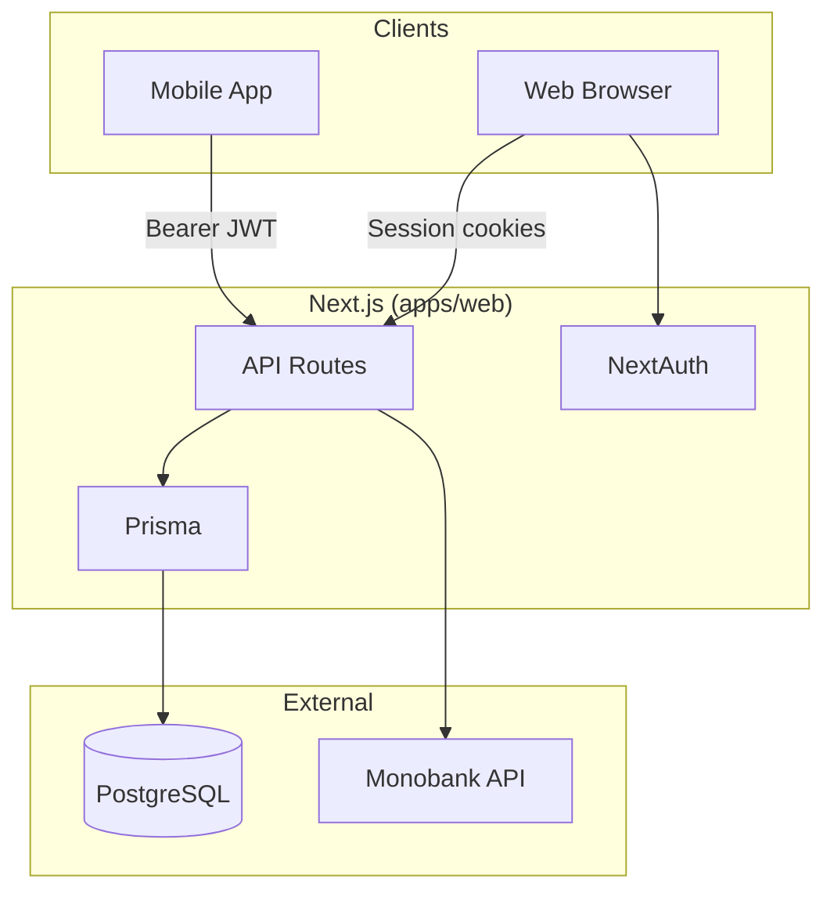

## BitChain

## Personal finance and trading journal with web and mobile clients, bank integration, and backup.


## Table of Contents

- [Overview](#overview)
- [Tech Stack](#tech-stack)
- [Architecture](#architecture)
- [Project Structure](#project-structure)
- [Getting Started](#getting-started)
- [Running the App](#running-the-app)
- [Available Scripts](#available-scripts)
- [Key Features](#key-features)
- [Contributing](#contributing)
- [License](#license)

## Overview

**BitChain** is a full-stack personal finance and trading journal application. It lets you track accounts, transactions, budgets, financial goals, and loans on the web, and sync trading activity with demo/live accounts. A mobile app (Expo) provides access to the same finance data via a dedicated JWT-based API.

**Why it exists** — Centralize personal finance tracking, trading journal, and bank integration (Monobank) in one place with a consistent experience across web and mobile.

**Current status** — Core modules implemented: trading (trades, categories, P&L), finance (accounts, transactions, budgets, goals, loans), Monobank integration, web (NextAuth) and mobile (custom JWT) auth, backup (JSON export/import). E2E tests and `ARCHITECTURE.md` are planned.

## Tech Stack

| Layer           | Technology                                 |
| --------------- | ------------------------------------------ |
| Web             | Next.js 15.5 (App Router, Turbopack)       |
| Web             | React 19, TailwindCSS 4                    |
| Web             | Radix UI (Shadcn-style), CVA               |
| Web             | TanStack Query 5, Zustand 5                |
| Web             | React Hook Form 7, Zod 3.24                |
| Web             | NextAuth 4 (JWT session)                   |
| Web             | Prisma 6.6, PostgreSQL 14+                 |
| Mobile          | Expo 54, Expo Router 6                     |
| Mobile          | TanStack Query, Zustand, expo-secure-store |
| Shared          | @bit-chain/api-contracts (Zod schemas)     |
| Package Manager | pnpm                                       |

## Architecture

BitChain is a monorepo with a single Next.js backend serving both web (session cookies) and mobile (Bearer JWT) clients. Domain logic lives in feature modules under `apps/web/src/features/`; API routes are thin and delegate to domain services. Prisma is the single ORM; PostgreSQL is the database.

### System Overview



### Web Request Flow

```
Browser → Next.js API route → getServerSession(authOptions) → findOrCreateFinanceUserByEmail
       → Domain service → Prisma → PostgreSQL
       → NextResponse.json(payload)
```

### Mobile Request Flow

```
Mobile → axios (Bearer token) → /api/mobile/* → getMobileUser(request) → userId
      → Domain logic → Prisma → PostgreSQL
      → ok(data) or err(code, message, requestId)
```

## Project Structure

```
bit-chain/
├── apps/
│   ├── web/                          # Next.js web app
│   │   ├── prisma/
│   │   │   ├── schema.prisma         # output: src/generated/prisma
│   │   │   ├── migrations/
│   │   │   └── seed.ts
│   │   ├── scripts/                  # monobank-sync-all, remove-demo-data
│   │   └── src/
│   │       ├── app/
│   │       │   ├── (protected)/      # Sidebar shell: home, dashboard, analytics, journal, accounts,
│   │       │   │                      # transactions, categories, budget, goals, loans, reports, backup, settings
│   │       │   ├── (public)/         # Login, register; NextAuth under (public)/api/auth
│   │       │   └── api/              # finance/*, backup, crypto, integrations/monobank (incl. webhook), mobile/*, reports
│   │       ├── components/           # ui (shadcn-style), forms, layout (charts, nav), dashboard, backup
│   │       ├── features/
│   │       │   ├── auth/             # LoginForm, RegisterForm, AuthProvider
│   │       │   ├── backup/            # Schemas, backup UI hooks up to API
│   │       │   ├── crypto/            # Market cards, news
│   │       │   ├── finance/           # Accounts, transactions, budget, goals, categories, net worth, report hooks
│   │       │   ├── integrations/     # Monobank integration
│   │       │   ├── positions/         # Trades, categories, P&L, demo mode
│   │       │   └── reports/         # Comprehensive report (data + markdown sections)
│   │       ├── generated/prisma/     # Prisma client (generated)
│   │       ├── lib/                  # prisma, axios, backup, mobile-auth, monobank, rate-limit
│   │       └── store/
│   └── mobile/                       # Expo React Native app
│       ├── app/
│       │   ├── (app)/(tabs)/         # dashboard, transactions, etc.
│       │   └── (auth)/               # login
│       └── src/
│           ├── components/
│           ├── design/               # tokens
│           └── lib/                  # auth, api, query, network
├── packages/
│   ├── api-contracts/                # Zod schemas, ok/err helpers for mobile API
│   └── tsconfig/                     # base, nextjs, react-native configs
├── .github/workflows/
├── pnpm-workspace.yaml
└── package.json
```

## Getting Started

### Prerequisites

- **Node.js** >= 20.x
- **pnpm** >= 9.x — `npm install -g pnpm`
- **PostgreSQL** 14+

### Installation

```bash
git clone https://github.com/your-org/bit-chain.git
cd bit-chain
pnpm install
```

### Environment Setup

Copy the example env file and fill in your values:

```bash
cp apps/web/.env.example apps/web/.env
```

| Variable                        | Description                                  | Required      |
| ------------------------------- | -------------------------------------------- | ------------- |
| `DATABASE_URL`                  | PostgreSQL connection string                 | ✅            |
| `NEXTAUTH_SECRET`               | NextAuth JWT signing secret                  | ✅            |
| `NEXTAUTH_URL`                  | Web app URL (e.g. http://localhost:3000)     | ✅            |
| `NEXT_PUBLIC_API_URL`           | Override API base (default `/api`)           | optional      |
| `CRYPTOPANIC_API_KEY`           | Crypto news API                              | optional      |
| `COINGECKO_API_KEY`             | CoinGecko API                                | optional      |
| `MOBILE_JWT_SECRET`             | 64-char base64 for mobile JWT                | ✅ (mobile)   |
| `MOBILE_JWT_ACCESS_TTL_MINUTES` | Access token TTL (default 15)                | optional      |
| `MOBILE_JWT_REFRESH_TTL_DAYS`   | Refresh token TTL (default 30)               | optional      |
| `MONOBANK_ENCRYPTION_KEY`       | 32-byte base64 for Monobank token encryption | ✅ (Monobank) |

> **Security note:** Generate secrets with:
>
> ```bash
> # MOBILE_JWT_SECRET (64 bytes)
> node -e "console.log(require('crypto').randomBytes(64).toString('base64'))"
>
> # MONOBANK_ENCRYPTION_KEY (32 bytes)
> node -e "console.log(require('crypto').randomBytes(32).toString('base64'))"
> ```

For mobile, copy `apps/mobile/.env.example` to `apps/mobile/.env.local` and set `EXPO_PUBLIC_API_URL` to your API base (e.g. ngrok URL) for local development.

### Database

```bash
pnpm db:migrate
pnpm db:seed
```

## Running the App

```bash
# Development (Turbopack)
pnpm dev
```

Open [http://localhost:3000](http://localhost:3000) in your browser.

```bash
# Production build
pnpm build
pnpm start
```

```bash
# Mobile (Expo)
pnpm mobile:start
# or
pnpm mobile:ios
```

## Available Scripts

| Script                   | Description                                               |
| ------------------------ | --------------------------------------------------------- |
| `pnpm dev`               | Start Next.js dev server with Turbopack                   |
| `pnpm build`             | Prisma generate + Next.js build                           |
| `pnpm start`             | Build and start production server                         |
| `pnpm lint`              | ESLint check                                              |
| `pnpm lint:fix`          | ESLint with auto-fix                                      |
| `pnpm format:check`      | Prettier check                                            |
| `pnpm format:fix`        | Prettier write                                            |
| `pnpm type-check`        | TypeScript check (web)                                    |
| `pnpm type-check:all`    | TypeScript check (web + mobile)                           |
| `pnpm validate`          | lint:fix, format:fix, type-check, knip, build             |
| `pnpm db:migrate`        | `prisma migrate deploy`                                   |
| `pnpm db:seed`           | Seed database                                             |
| `pnpm db:remove-demo`    | Remove demo data                                          |
| `pnpm monobank:sync-all` | Sync Monobank transactions (requires `--email`, `--from`) |
| `pnpm mobile:start`      | Expo start                                                |
| `pnpm mobile:ios`        | Expo run:ios                                              |
| `pnpm mobile:type-check` | TypeScript check (mobile)                                 |

## Key Features

- **Finance module** — Accounts, transactions, categories, budgets, goals, loans; analytics and net worth views on web
- **Reports** — Comprehensive finance report (web) via `/api/reports/comprehensive`
- **Trading module** — Trades, categories, screenshots, P&L, demo/live accounts
- **Monobank integration** — Connect, manual sync, optional webhook for statement items, per-account import toggle
- **Web auth** — NextAuth JWT session, credentials provider
- **Mobile auth** — Custom JWT access/refresh tokens, SecureStore, Bearer API
- **Backup** — JSON export/import with merge/replace

## License

[MIT](LICENSE) © 2026 BitChain
